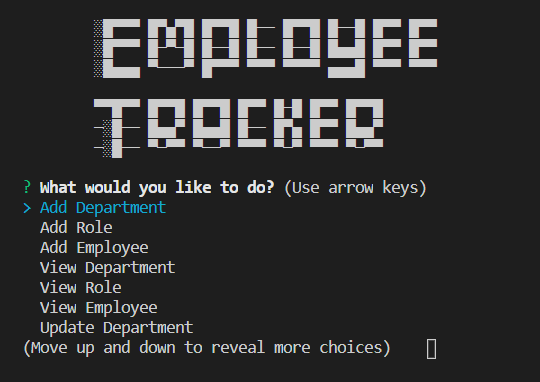

# Employee-Tracker

## Description

This is an application designed to assiste with the tracking of personnel within a company. Using command line prompts, a user is able to view, add, and edit different dperatments, roles and employees.

## User Employee Tracker

Once the repository has been cloned. Ensure all necessary modules have been installed(mysql, inquirer).

Open a command line on server.js. The app will start up and open with a welcome title. The home menu will be displayed with a variety of options.

The options on the home menu include: add department, add role, add employee, view department, view roles, view employees, update departments, update roles, update employees. Upcoming updates include the delete function for departments, roles, and employees.

## Uses

This application can be used in almost any office or business setting to easily track and reference different departments and employees. The application is simple enopugh so that it can be modified and tailored to specific application within any business.

Little effort is needed to customize the information stored for each of the three tables (Departments, Roles, EMployees)

## Upcoming Updates

In the future, the delete function will be added for all three of the tables. 
Addition of more columns per table will be addedf that will allow more information to be recorded per table.
Further functions will be added to home screen that will allow easy access to compiled information such as cost of a department based on the salary of all employees that fall under that departments umbrella.

## Contact
github: [StevenJ87](https://github.com/StevenJ87)

## ScreenShot Examples

Home Menu

